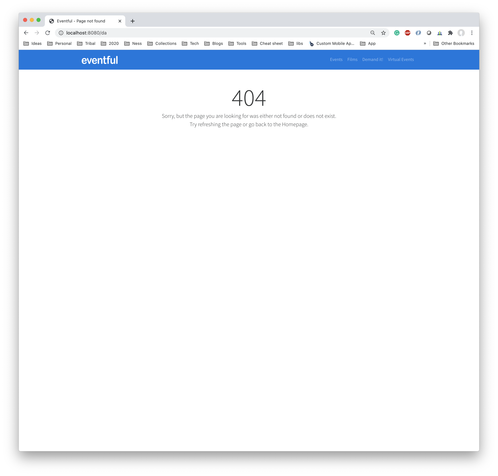

# Eventful SpringBoot Demo
Spring boot demo application that connects to the EventFul.com API and retrieves event data for London.

* Spring boot web
* Thymeleaf template engine
* Feign client
* Spring boot cache support

**Listing page**

**Error page**

